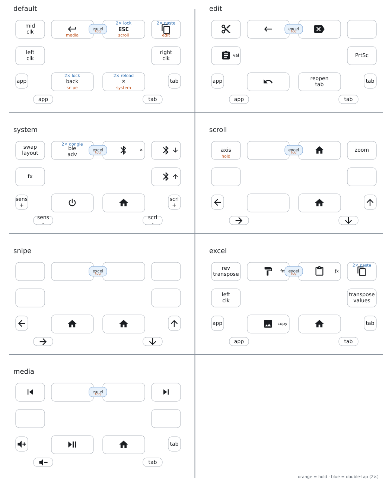

### Firmware for PAW3395 

[Download latest UF2](https://nightly.link/phuertay/endgame-trackball-config/workflows/build/paw3395/firmware.zip)

The `firmware.zip` contains two files:
- `efogtech_trackball_0-zmk.uf2` — the normal firmware.
- `efogtech_trackball_0-settings-reset.uf2` — flash this once to wipe the settings/keymap saved on the device (ZMK Studio persists the keymap to on-device storage, which otherwise shadows keymap changes shipped in new firmware), then flash the normal firmware.

### Keymap

The diagram is generated from the keymap by [keymap-drawer](https://github.com/caksoylar/keymap-drawer) and refreshed automatically by the `Draw keymap` GitHub Action whenever the keymap changes. It uses a compact draw-only layout (shorter side keys, larger type) defined in `keymap-drawer/draw-layout.dtsi` — firmware geometry is unchanged. Labels live in `keymap_drawer.config.yaml`.

Each GitHub release also includes a single-page `keymap-layout.pdf` of the same diagram. See [keymap-drawer/keymap.pdf](keymap-drawer/keymap.pdf) in the repo as well.

